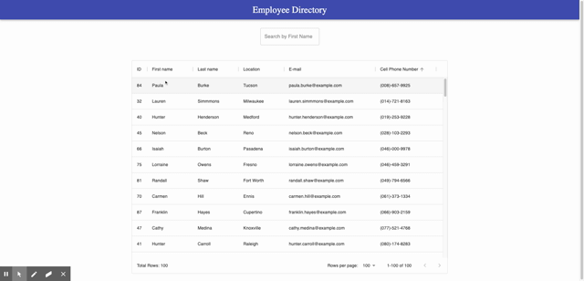

# Employee Directory
## Description
This repository contains a proof of concept for an employee directory organizer. Currently it uses an API to display information for random users. This is rendered on the page with a react app. You are able to sort any column by clicking on the header and you can filter the users by first name through entering a filter value in the search box. The use case of this would be for easy management and quickly accessing information as a manager of employees.

## Table of Contents
[Description](#Description)

[Usage](#Usage)

[Contributing](#Contributing)

[Tests](#Tests)

[Questions](#Questions)

## Usage
Usage is pretty simple. You may sort any column by clicking on the header. You can filter the values by searching a first name in the search box at the top.

## Contributing
Contributions are welcome!

## Tests
This project does not currently have any tests.

## Questions

If you have any questions, please contact me at smarten.developer@gmail.com!
